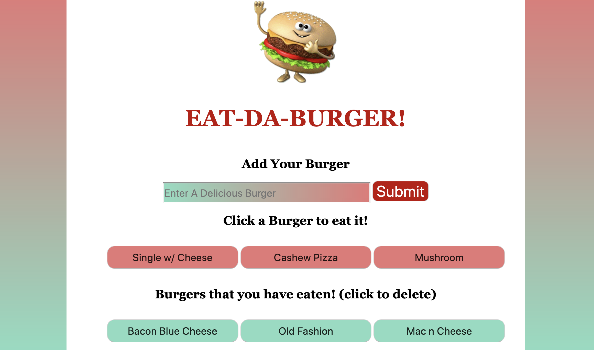

# Eat Da Burger

Eat-Da-Burger! is a restaurant app that lets users input the names of burgers they'd like to eat. This app is created with MySQL, Node, Express, Handlebars and a homemade ORM. Node and MySQL are used to query and route data, and Handlebars to generate HTML.

How to use:

* Whenever a user submits a burger's name, the burger will display in the burgers to eat area -- waiting to be eaten.
Click the burger to eat it and the burger will move to the burgers that have been eaten area.

Heroku deployment: https://say-eatdaburger.herokuapp.com/
--

License
---

MIT License

Copyright (c) [2020] [Sharon A. Yelverton]

Permission is hereby granted, free of charge, to any person obtaining a copy of this software and associated documentation files (the "Software"), to deal in the Software without restriction, including without limitation the rights to use, copy, modify, merge, publish, distribute, sublicense, and/or sell copies of the Software, and to permit persons to whom the Software is furnished to do so, subject to the following conditions:

The above copyright notice and this permission notice shall be included in all copies or substantial portions of the Software.

THE SOFTWARE IS PROVIDED "AS IS", WITHOUT WARRANTY OF ANY KIND, EXPRESS OR IMPLIED, INCLUDING BUT NOT LIMITED TO THE WARRANTIES OF MERCHANTABILITY, FITNESS FOR A PARTICULAR PURPOSE AND NONINFRINGEMENT. IN NO EVENT SHALL THE AUTHORS OR COPYRIGHT HOLDERS BE LIABLE FOR ANY CLAIM, DAMAGES OR OTHER LIABILITY, WHETHER IN AN ACTION OF CONTRACT, TORT OR OTHERWISE, ARISING FROM, OUT OF OR IN CONNECTION WITH THE SOFTWARE OR THE USE OR OTHER DEALINGS IN THE SOFTWARE.

